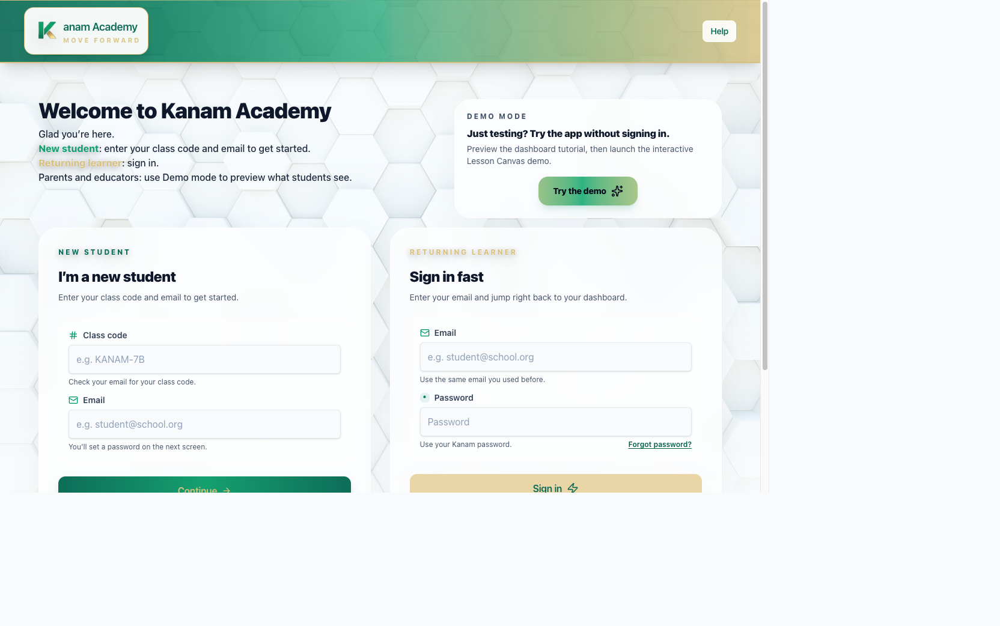
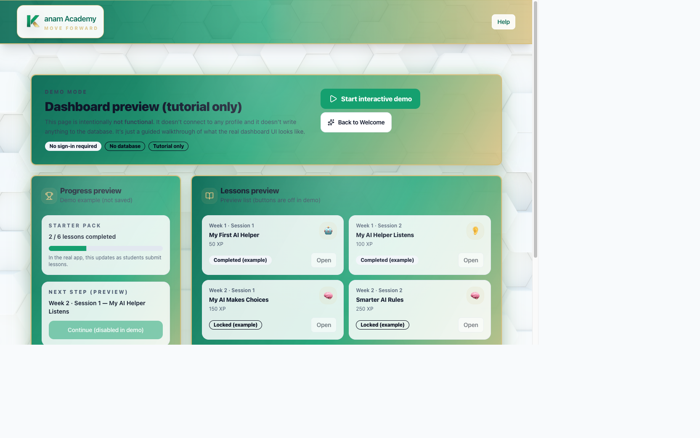
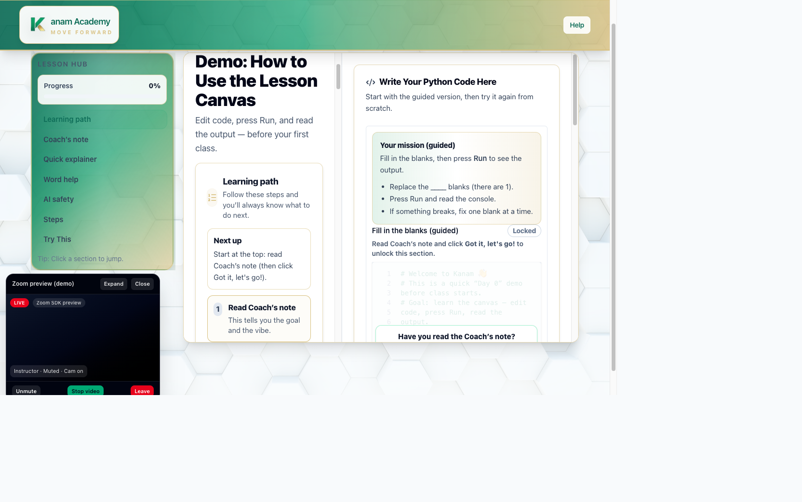
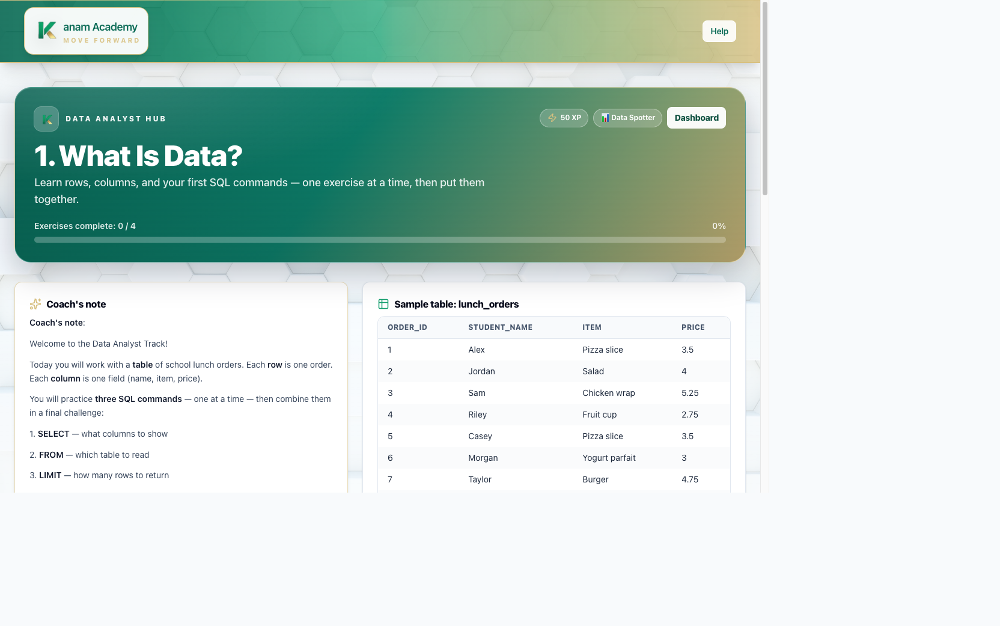
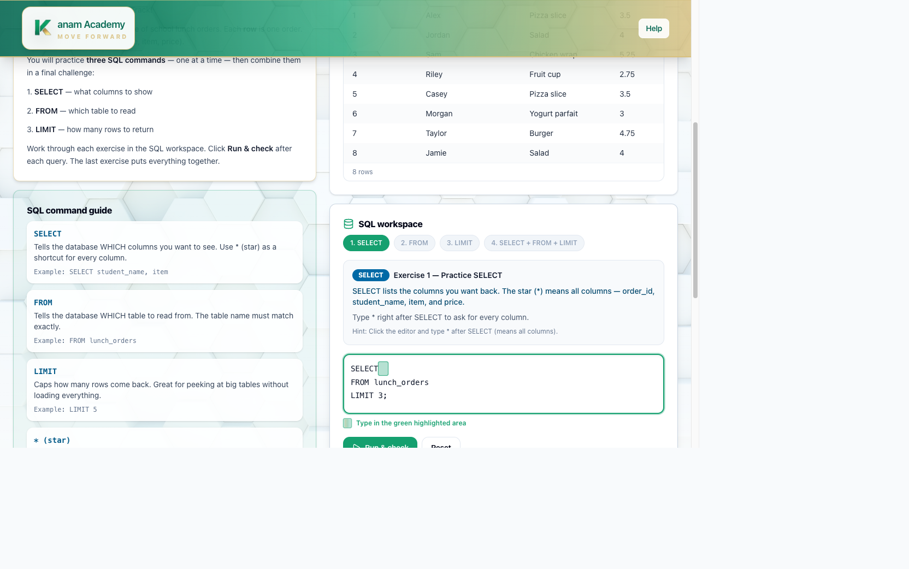

<div align="center">


# Kanam Academy

### Live, instructor-led coding classes for middle schoolers — with a game-style Lesson Canvas, a real Python runner, and an in-browser SQL engine.

[](https://nextjs.org/)
[](https://react.dev/)
[](https://www.typescriptlang.org/)
[](https://tailwindcss.com/)
[](https://supabase.com/)
[](https://sql.js.org/)

</div>

---

Kanam Academy is a **middle-school–friendly coding platform** built for live, Zoom-style instruction (grades **6–8**). Learners write and run real code in the browser, follow a guided "Learning Path," and earn XP and badges as they progress through two structured tracks: **AI + Python** and **Data Analyst (SQL)**.

The UX is designed for young learners: clear steps, big buttons, plain-English explainers, and game-style language — with an optional **Demo mode** so parents, educators, and first-time visitors can preview everything without signing in.

## Highlights

- **Interactive Lesson Canvas** — guided fill-in-the-blanks plus a from-scratch editor, a live console, check-for-understanding prompts, and an instructor video panel.
- **Two 8-week learning tracks** — a 13-lesson AI + Python path and a 14-lesson Data Analyst (SQL) path, each paced over 8 weeks (two sessions/week) with XP and collectible badges.
- **Runs entirely in the browser** — a beginner-safe Python runner and a real SQLite engine (`sql.js` / WASM) power the exercises with no backend round-trips.
- **Tell the story with charts** — later SQL lessons turn query results into visualizations with Recharts.
- **Demo mode** — explore the dashboard and a full interactive lesson with zero sign-up.
- **Progress that sticks** — Supabase Auth + Postgres track completions, XP, and badges per student.

## Screenshots

|  |  |
| :---: | :---: |
| <br/>**Welcome** — new students, returning learners, and demo mode | <br/>**Dashboard** — tracks, progress, XP, and next steps |
| <br/>**Lesson Canvas** — guided editor, learning path, live instructor video | <br/>**Data Analyst track** — premium lesson hero with sample data |
| <br/>**SQL workspace** — write queries, run, and get instant feedback | |

## Tech stack

| Area | Technology |
| --- | --- |
| Framework | [Next.js 16](https://nextjs.org/) (App Router, Turbopack) |
| UI | [React 19](https://react.dev/), [TypeScript 5](https://www.typescriptlang.org/) |
| Styling | [Tailwind CSS 4](https://tailwindcss.com/), [Radix UI](https://www.radix-ui.com/), [Framer Motion](https://www.framer.com/motion/), [Lucide](https://lucide.dev/) icons |
| Data viz | [Recharts](https://recharts.org/) |
| In-browser SQL | [sql.js](https://sql.js.org/) (SQLite compiled to WebAssembly) |
| Python | Custom beginner-safe runner (`lib/pythonRunner.ts`) |
| Auth & DB | [Supabase](https://supabase.com/) (SSR Auth + Postgres) |

## Quick start

### 1. Install and run

```bash
npm install
npm run dev
```

Open [http://localhost:3000](http://localhost:3000).

> Want to look around immediately? Visit **`/demo`** for the dashboard tour and **`/learn/demo`** for a fully interactive lesson — no account required.

### 2. Configure environment variables

Create a `.env.local` in the repo root using `config/env.example` as a guide:

| Variable | Required | Description |
| --- | :---: | --- |
| `NEXT_PUBLIC_SUPABASE_URL` | ✅ | Supabase project URL |
| `NEXT_PUBLIC_SUPABASE_ANON_KEY` | ✅ | Supabase anon public key |
| `NEXT_PUBLIC_KANAM_SLOGAN` | — | Marketing copy shown on the Welcome screen |
| `NEXT_PUBLIC_DATA_ANALYST_UNLOCK_FOR_TESTING` | — | Legacy / unused (Data Analyst is unlocked for everyone) |
| `SUPABASE_SERVICE_ROLE_KEY` | — | Server-only; required for admin actions |
| `INSTRUCTOR_INVITE_CODE` | — | Server-only; gate for creating instructor accounts |

### 3. Set up the database

This app uses Supabase for **Auth** + **Postgres** progress tracking.

1. In Supabase, open **SQL Editor**.
2. Run [`supabase/schema.sql`](supabase/schema.sql).

Supabase helpers live in `lib/supabase/` — `browser.ts`, `server.ts`, and `admin.ts` (server-only).

## Learning tracks

Both tracks are paced as **8-week programs** (two sessions per week), built to be done **self-paced or with light assistance** — every lesson explains, checks, and corrects itself. See the [curriculum docs](docs/curriculum/) for the full week-by-week plan and standards alignment.

### 🤖 AI + Python Starter Pack — 8 weeks · 13 lessons

Build your first AI helper with Python: variables, input, conditionals, loops, patterns, lists, functions, parameters, and a final "Build Your AI NPC" capstone (50 → 700 XP). Includes a Week 4 checkpoint/debugging lab and Week 7 capstone planning so nothing is left as a gap.

### 📊 Data Analyst Track — 8 weeks · 14 lessons

Learn SQL from `SELECT` to a final data project — columns, `WHERE`, `ORDER BY`, `GROUP BY`, `JOIN`, `HAVING`, then a full data-visualization strand (bar, pie, line, histogram, scatter) before the capstone (50 → 700 XP). Available alongside the other tracks (no Python prerequisite gate).

## Key routes

| Route | Description |
| --- | --- |
| `/welcome` | Entry point — sign in, sign up, or demo |
| `/demo` | Dashboard preview (tutorial only, no sign-in) |
| `/learn/demo` | Interactive demo lesson |
| `/learn/1` … `/learn/13` | AI + Python lessons |
| `/learn/data/1` … `/learn/data/14` | Data Analyst (SQL) lessons |
| `/dashboard` | Student dashboard (tracks + progress) |
| `/instructor` | Instructor dashboard |

## Project structure

```text
app/                 # Next.js App Router pages
  welcome/           # Auth + onboarding flows
  learn/             # Python lessons (1–13) + demo
  learn/data/        # Data Analyst SQL lessons (1–10)
  demo/              # No-login dashboard preview
  instructor/        # Instructor view
  api/               # Auth + health API routes
components/
  lesson/            # Python Lesson Canvas
  data/              # SQL canvas, result table, chart panel
  python/            # Python editor + lesson canvas
  dashboard/         # Track roadmap
  ui/                # Shared UI primitives
lib/
  pythonRunner.ts    # In-browser Python execution
  pythonLessons/     # Lesson content (1–13)
  sqlRunner.ts       # sql.js / SQLite engine
  dataLessonHelpers.ts  # Seed data + answer validation
  tracks.ts          # Track + lesson definitions
  supabase/          # Auth + DB clients
supabase/schema.sql  # Database schema
public/              # Logo, images, screenshots, sql-wasm.wasm
```

## Instructor notes

- **Instructor view toggle:** append `?instructor=1` to a lesson URL to reveal instructor-only blocks.
- **Instructor dashboard:** `/instructor`.
- **Create an instructor account (staff-only):** set `SUPABASE_SERVICE_ROLE_KEY` and `INSTRUCTOR_INVITE_CODE`, then go to `/welcome` → "Create instructor account."

## Scripts

| Command | Description |
| --- | --- |
| `npm run dev` | Start the dev server (Turbopack) |
| `npm run build` | Production build |
| `npm run start` | Run the production build |
| `npm run lint` | Lint with ESLint |

## Deployment

The app deploys cleanly to any Next.js-compatible host (e.g. [Vercel](https://vercel.com/)). Set the environment variables above in your host's dashboard, run `supabase/schema.sql` against your production database, and ship.

---

<div align="center">

**Kanam Academy** · Move forward.

</div>
