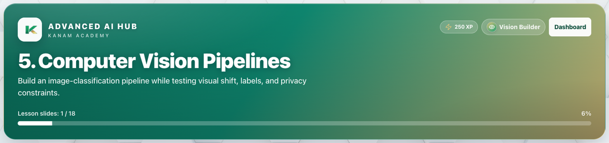

# Facilitator guide — Advanced AI · Week 3 · Session 1

**Lesson id:** `aai-5` · **URL:** `/learn/advanced-ai/5`

---

## 1. Session snapshot

| Field | Value |
| --- | --- |
| **Track / lesson id** | `advanced-ai` / `aai-5` |
| **Title** | Computer Vision Pipelines |
| **Time** | 50–70 min |
| **Week theme** | Neural Nets & Vision |
| **Student goal** | Complete **Computer Vision Pipelines** and demonstrate the week focus: Layers, overfitting, and computer-vision pipelines with privacy checks. |
| **Standards** | CSTA AI specialty / IC · DA |
| **Materials** | Browser devices · projector · note-taking for audits |
| **XP / badge** | 250 · Vision Builder |

**Learning objectives**

1. Explain today’s big idea in plain language.
2. Apply it to at least one realistic scenario.
3. Complete the in-lesson check / quiz with justifiable answers.
4. Name one habit or next action they’ll keep.

---

## 2. Pre-class setup

- [ ] Open `/learn/advanced-ai/5` on the projector (lesson loads)
- [ ] Confirm Help / Guidance panel is reachable
- [ ] Decide self-paced vs live cohort pacing
- [ ] Optional: complete the first check yourself
- [ ] Bookmark instructor progress for end-of-class glance

**Projector tips:** Zoom ~110%; keep feedback / console / quiz results visible when demoing.

---

## 3. Run of show

| Minutes | Phase | Facilitator | Students |
| ---: | --- | --- | --- |
| 0–5 | **Warm-up** | Ask: “Where did you see AI today — and was it helpful or risky?” | Quick share |
| 5–20 | **Teach** | Frame the system decision / metric / risk | Take notes; ask clarifying Qs |
| 20–50 | **Studio** | Circulate; require written rationale before “ship” claims | Build / evaluate / audit tasks |
| 50–60 | **Defend** | Cold-call one tradeoff (fairness, privacy, cost, accuracy) | 60-sec defend |
| 60–70 | **Close** | Exit ticket | Reflection |

### Teaching focus

Week theme: **Neural Nets & Vision**.  
Focus: Layers, overfitting, and computer-vision pipelines with privacy checks.

Keep the session on one job: students can explain today’s idea in plain language and show evidence in the product (exercise success, quiz, or studio artifact).

---

## 4. Screenshot callouts

| ID | Capture | Filename |
| --- | --- | --- |
| A | Lesson hero / title + goal | `aai-w3-s1-hero.png` |
| B | Lesson / Exercises (or Quiz) tabs | `aai-w3-s1-tabs.png` |
| C | Help / Coach guidance open | `aai-w3-s1-help.png` |
| D | Main workspace (editor, query, or quiz) | `aai-w3-s1-editor.png` |
| E | Success / check state | `aai-w3-s1-run.png` |
| F | Evidence panel (console, chart, or score) | `aai-w3-s1-console.png` |

**Capture checklist:** local unlock → `/learn/advanced-ai/5` → Lesson → Practice/Quiz → success state → save under `facilitator-guides/images/`.

---

## 5. What “good” looks like

- **Mastery signal:** Student can restate the goal and show product evidence (green check, quiz pass, or studio artifact) without reading the answer key.
- **Common mistakes:**
- Jumping to tools before framing the decision
- Metrics without owners / human gates
- Ignoring privacy or fairness tradeoffs
- **Differentiation:**
  - **Needs support:** Stay on guided path; re-read Help / Word help; use hints before scratch.
  - **Ready for more:** Try This / stretch scenario; teach-back to a peer in 60 seconds.

---

## 6. Exit ticket & instructor progress

**Exit ticket:** *What can you do now that you couldn’t do before this session — and how do you know?*

**Progress check:** Confirm lesson opened + check success (exercise / quiz / assessment). Incomplete usually means stuck on a single concept — return to Help, not a new lecture.
