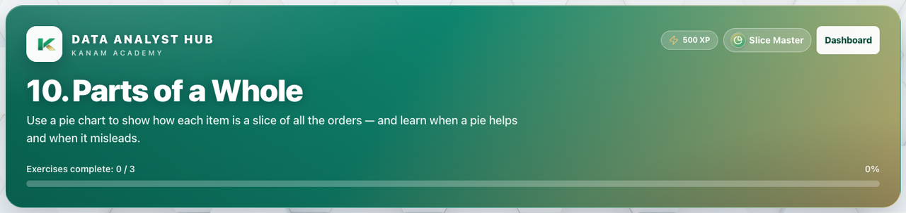

# Facilitator guide — Data Analyst · Week 5 · Session 2

**Lesson id:** `da-10` · **URL:** `/learn/data/10`

---

## 1. Session snapshot

| Field | Value |
| --- | --- |
| **Track / lesson id** | `data-analyst` / `da-10` |
| **Title** | Parts of a Whole |
| **Time** | 45–60 min |
| **Week theme** | Comparing with Charts |
| **Student goal** | Use a pie chart to show how each item is a slice of all the orders — and learn when a pie helps and when it misleads. |
| **Standards** | CSTA 2-DA / 3A-DA · CCSS SP (see track doc) |
| **Materials** | Browser devices · projector · SQL workspace visible |
| **XP / badge** | 500 · Slice Master |

**Learning objectives**

1. State today’s goal in one sentence.
2. Complete guided practice with feedback.
3. Complete the scratch / unaided challenge (or equivalent).
4. Pass the lesson check (exercise success and/or CFU).

---

## 2. Pre-class setup

- [ ] Open `/learn/data/10` on the projector (lesson loads)
- [ ] Confirm Help / Guidance panel is reachable
- [ ] Decide self-paced vs live cohort pacing
- [ ] Optional: complete the first check yourself
- [ ] Bookmark instructor progress for end-of-class glance

**Projector tips:** Zoom ~110%; keep feedback / console / quiz results visible when demoing.

---

## 3. Run of show

| Minutes | Phase | Facilitator | Students |
| ---: | --- | --- | --- |
| 0–5 | **Warm-up** | Ask a real-world question the data could answer today (theme: Comparing with Charts). | Think / pair share |
| 5–15 | **Teach** | Open Lesson tab; paraphrase coach’s note / Word help | Follow along |
| 15–40 | **Practice** | Circulate; hints before answers; celebrate first green checks | guided query → scratch query |
| 40–50 | **Check** | result rows / chart; ask “what does this prove?” | Answer / show output |
| 50–60 | **Close** | Exit ticket + preview next session | One-sentence reflection |

### Coach’s note (from product — paraphrase)

**Coach's note**:
A bar chart compares categories. A **pie chart** answers a different question: *what share of the whole is each part?*

A pie needs the same two columns as a bar chart:
1. A **label** column (the slices) → **item**
2. A **number** column (the slice sizes) → **order_count**

Because every slice is a piece of one whole, the numbers should **add up to a meaningful total** (here, all the orders).

**When a pie works:** a few parts (2–6) that together make 100%.
**When a pie misleads:** too many tiny slices, or parts that don't add up to one whole. Then a bar chart is clearer.

---

## 4. Screenshot callouts

| ID | Capture | Filename |
| --- | --- | --- |
| A | Lesson hero / title + goal | `data-w5-s2-hero.png` |
| B | Lesson / Exercises (or Quiz) tabs | `data-w5-s2-tabs.png` |
| C | Help / Coach guidance open | `data-w5-s2-help.png` |
| D | Main workspace (editor, query, or quiz) | `data-w5-s2-editor.png` |
| E | Success / check state | `data-w5-s2-run.png` |
| F | Evidence panel (console, chart, or score) | `data-w5-s2-console.png` |

**Capture checklist:** local unlock → `/learn/data/10` → Lesson → Practice/Quiz → success state → save under `facilitator-guides/images/`.

---

## 5. What “good” looks like

- **Mastery signal:** Student can restate the goal and show product evidence (green check, quiz pass, or studio artifact) without reading the answer key.
- **Common mistakes:**
- Forgetting `FROM` / wrong table name
- Filtering after aggregating (or vice versa) without intent
- Reading the chart without reading the query result
- **Differentiation:**
  - **Needs support:** Stay on guided path; re-read Help / Word help; use hints before scratch.
  - **Ready for more:** Try This / stretch scenario; teach-back to a peer in 60 seconds.

---

## 6. Exit ticket & instructor progress

**Exit ticket:** *What can you do now that you couldn’t do before this session — and how do you know?*

**Progress check:** Confirm lesson opened + check success (exercise / quiz / assessment). Incomplete usually means stuck on a single concept — return to Help, not a new lecture.
