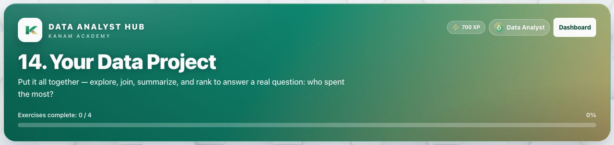

# Facilitator guide — Data Analyst · Week 8 · Session 1

**Lesson id:** `da-14` · **URL:** `/learn/data/14`

---

## 1. Session snapshot

| Field | Value |
| --- | --- |
| **Track / lesson id** | `data-analyst` / `da-14` |
| **Title** | Capstone: Cafeteria Briefing |
| **Time** | 45–60 min (may spill into Session 2) |
| **Week theme** | Capstone: Cafeteria Briefing |
| **Student goal** | Run a from-scratch multi-question cafeteria investigation and deliver an evidence-based briefing. |
| **Standards** | CSTA 2-DA / 3A-DA · CCSS SP (see track doc) |
| **Materials** | Browser devices · projector · SQL workspace visible |
| **XP / badge** | 700 · Data Analyst |

**Learning objectives**

1. Explore both tables and state the shared key.
2. Write JOINs, filters, and aggregates from scratch (14 activities).
3. Answer multiple briefing questions (top spender, popular item, big spenders).
4. Deliver a ranked spend chart plus a one-sentence conclusion with a limitation.

---

## 2. Pre-class setup

- [ ] Open `/learn/data/14` on the projector (lesson loads)
- [ ] Confirm Help / Guidance panel is reachable
- [ ] Decide self-paced vs live cohort pacing (this session is activity-heavy)
- [ ] Optional: complete Activities 1–5 yourself
- [ ] Bookmark instructor progress for end-of-class glance

**Projector tips:** Zoom ~110%; keep feedback / console / chart visible when demoing.

---

## 3. Run of show

| Minutes | Phase | Facilitator | Students |
| ---: | --- | --- | --- |
| 0–5 | **Warm-up** | “What would a cafeteria manager need to know after one week of sales?” | Think / pair share |
| 5–12 | **Teach** | Brief pipeline reminder only — do **not** demo the final answers | Follow along / open plan notes |
| 12–50 | **Practice** | Circulate; hints before answers; celebrate green checks | 14 activities (mostly from scratch) |
| 50–55 | **Check** | Ask for top spender + popular item + one limitation | Share findings |
| 55–60 | **Close** | Ethics: named spending rankings | One-sentence briefing |

### Coach’s note (from product — paraphrase)

This is the track capstone — a multi-question cafeteria briefing on a richer two-table dataset (6 students, 21 orders). Students should write most queries **from scratch**. Stay in coach mode: ask for predicted row counts before they run; point to the command reference; celebrate the briefing sentence.

---

## 4. Screenshot callouts

| ID | Capture | Filename |
| --- | --- | --- |
| A | Lesson hero / title + goal | `data-w8-s1-hero.png` |
| B | Lesson / Exercises tabs | `data-w8-s1-tabs.png` |
| C | Help / Coach guidance open | `data-w8-s1-help.png` |
| D | Main workspace (blank scratch editor) | `data-w8-s1-editor.png` |
| E | Success / check state | `data-w8-s1-run.png` |
| F | Spend bar chart | `data-w8-s1-console.png` |

**Capture checklist:** local unlock → `/learn/data/14` → Lesson → Practice → success state → save under `facilitator-guides/images/`.

---

## 5. Answer keys (facilitator only)

| Finding | Expected |
| --- | --- |
| Students / orders | 6 / 21 |
| JOIN row count | 21 |
| Orders with `price >= 4` | 11 |
| Top spender | Casey · $18.75 |
| Most orders | Alex · 5 |
| Most popular item | Pizza slice · 5 |
| Big spenders (`HAVING SUM > 14`) | Alex & Casey |

---

## 6. Exit ticket

One sentence: *What should the cafeteria manager do next week, and what can’t this dataset prove?*
