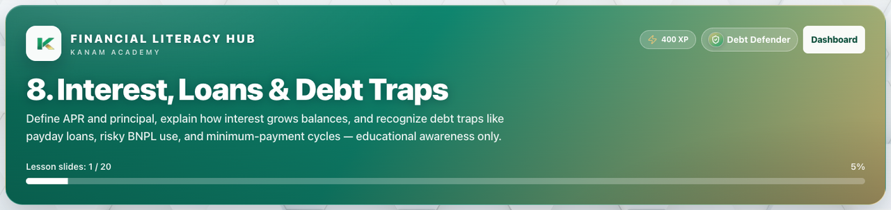

# Facilitator guide — Financial Literacy · Week 4 · Session 2

**Lesson id:** `fl-8` · **URL:** `/learn/finance/8`

---

## 1. Session snapshot

| Field | Value |
| --- | --- |
| **Track / lesson id** | `financial-literacy` / `fl-8` |
| **Title** | Interest, Loans & Debt Traps |
| **Time** | 40–55 min |
| **Week theme** | Credit & Debt |
| **Student goal** | Complete **Interest, Loans & Debt Traps** and demonstrate the week focus: Credit scores and reports, then interest, loans, and avoiding debt traps. |
| **Standards** | Jump$tart / CEE 2021 |
| **Materials** | Browser devices · projector · age-appropriate money examples |
| **XP / badge** | 400 · Debt Defender |

**Learning objectives**

1. Explain today’s big idea in plain language.
2. Apply it to at least one realistic scenario.
3. Complete the in-lesson check / quiz with justifiable answers.
4. Name one habit or next action they’ll keep.

---

## 2. Pre-class setup

- [ ] Open `/learn/finance/8` on the projector (lesson loads)
- [ ] Confirm Help / Guidance panel is reachable
- [ ] Decide self-paced vs live cohort pacing
- [ ] Optional: complete the first check yourself
- [ ] Bookmark instructor progress for end-of-class glance

**Projector tips:** Zoom ~110%; keep feedback / console / quiz results visible when demoing.

---

## 3. Run of show

| Minutes | Phase | Facilitator | Students |
| ---: | --- | --- | --- |
| 0–5 | **Warm-up** | Ask: “What’s one money decision teens face this month?” | Pair share |
| 5–20 | **Teach** | Walk Lesson slides; emphasize one big idea from: *Credit scores and reports, then interest, loans, and avoiding debt traps.* | Follow Lesson tab |
| 20–40 | **Apply** | Scenario / discussion; push for justified recommendations | Discuss + decide |
| 40–50 | **Check** | Knowledge check / quiz; review wrong answers as teaching | Complete check |
| 50–55 | **Close** | Exit ticket | One takeaway |

### Teaching focus

Week theme: **Credit & Debt**.  
Focus: Credit scores and reports, then interest, loans, and avoiding debt traps.

Keep the session on one job: students can explain today’s idea in plain language and show evidence in the product (exercise success, quiz, or studio artifact).

---

## 4. Screenshot callouts

| ID | Capture | Filename |
| --- | --- | --- |
| A | Lesson hero / title + goal | `fl-w4-s2-hero.png` |
| B | Lesson / Exercises (or Quiz) tabs | `fl-w4-s2-tabs.png` |
| C | Help / Coach guidance open | `fl-w4-s2-help.png` |
| D | Main workspace (editor, query, or quiz) | `fl-w4-s2-editor.png` |
| E | Success / check state | `fl-w4-s2-run.png` |
| F | Evidence panel (console, chart, or score) | `fl-w4-s2-console.png` |

**Capture checklist:** local unlock → `/learn/finance/8` → Lesson → Practice/Quiz → success state → save under `facilitator-guides/images/`.

---

## 5. What “good” looks like

- **Mastery signal:** Student can restate the goal and show product evidence (green check, quiz pass, or studio artifact) without reading the answer key.
- **Common mistakes:**
- Clicking through quiz without discussing why
- Slogan answers (“just be safe”) without a concrete control or habit
- Treating AI / policy claims as facts without a verification step
- **Differentiation:**
  - **Needs support:** Stay on guided path; re-read Help / Word help; use hints before scratch.
  - **Ready for more:** Try This / stretch scenario; teach-back to a peer in 60 seconds.

---

## 6. Exit ticket & instructor progress

**Exit ticket:** *What can you do now that you couldn’t do before this session — and how do you know?*

**Progress check:** Confirm lesson opened + check success (exercise / quiz / assessment). Incomplete usually means stuck on a single concept — return to Help, not a new lecture.
