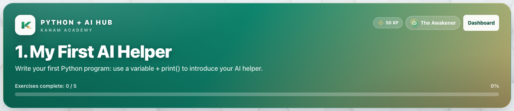
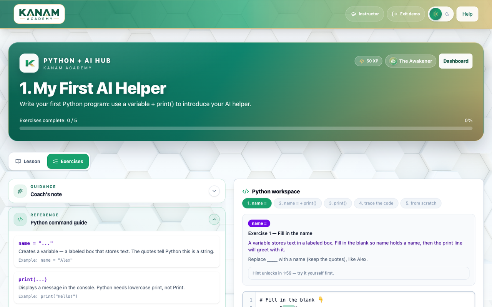
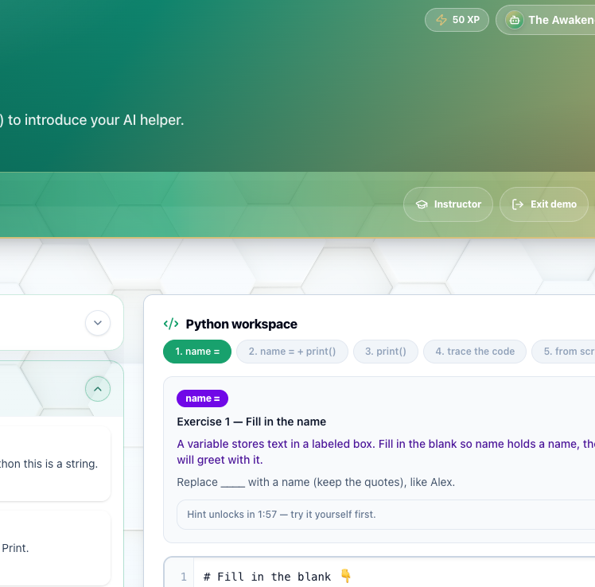

# Facilitator guide — Python & AI · Week 1 · Session 1

**Lesson id:** `lesson-1` · **URL:** `/learn/1`  
**Title:** My First AI Helper  
**Source config:** `lib/pythonLessons/lesson1.ts`

---

## 1. Session snapshot

| Field | Value |
| --- | --- |
| **Time** | 45–60 min |
| **Week theme** | Meet Your AI Helper — output, variables, and input |
| **Student goal** | Write your first Python program: use a variable + `print()` to introduce your AI helper. |
| **Standards** | `2-AP-11`, `2-AP-19`, `2-IC-20` |
| **Materials** | Browser devices · projector · optional paper |
| **XP / badge** | 50 · The Awakener |

**Learning objectives**

1. Declare a clearly named string variable.
2. Use the assignment operator correctly.
3. Build output with string concatenation.
4. Debug the two most common literal-string errors (missing quotes, missing spaces).

**Evidence of mastery:** Scratch program runs without errors and prints one sentence containing a variable value.

---

## 2. Pre-class setup

- [ ] Open `/learn/1` as the learner would see it (Lesson + Activity tabs)
- [ ] Confirm Help Pocket shows the coach note on desktop and in the mobile header
- [ ] Run the target program once yourself:

```python
name = "Alex"
print("Hello! I am " + name)
```

- [ ] Decide: live demo first vs students open immediately (first session often benefits from a 3-min demo)
- [ ] Projector: leave console visible under the editor

---

## 3. Run of show

| Minutes | Phase | Facilitator | Students |
| ---: | --- | --- | --- |
| 0–5 | **Warm-up** | Ask: *“If I tell a robot ‘say hello’ but forget to say *how*, what might happen?”* | Share 1 idea with a neighbor |
| 5–15 | **Teach** | Paraphrase the coach’s note (below). Stress: computers don’t guess; `=` means assign; quotes mean text; `+` glues strings and does **not** add spaces for you. | Follow Help Pocket / Lesson tab; skim Word help |
| 15–30 | **Practice (guided)** | Point students to Exercise 1 (fill in the name). Circulate. If stuck, ask “Are your quotes closed?” before giving the answer. | Complete fill exercise · Run & check |
| 30–45 | **Practice (scratch)** | Challenge: write the greeting from scratch. Celebrate first green checks publicly (optional). | Scratch program · fix errors using console |
| 45–55 | **CFU** | Ask aloud (or use in-product CFU): Why do spaces inside quotes matter? What’s the difference between `name` and `"name"`? | Answer; reveal only after attempt |
| 55–60 | **Close** | Exit ticket. Preview Session 2: “Next time the helper *listens* with `input()`.” | One-sentence reflection |

### Coach’s note (from product — paraphrase, don’t read robotically)

Welcome to Kanam Academy. Today you’re going to teach a computer how to introduce itself.

**Big idea (also a core AI idea):** Computers (and AI systems) do **not** guess. They follow instructions exactly.

**What you’re building:** A **variable** that stores text (your name), and a **`print()`** line that displays a full sentence.

**Target program:**

```python
name = "Alex"
print("Hello! I am " + name)
```

**Two super common mistakes:** (1) Quotes — without them, Python thinks you mean a variable. (2) Spaces — put the space inside the quotes: `"I am "`.

**Success today** = scratch code runs without errors **and** prints one sentence that includes your name.

### Guided steps (product)

1. Create a variable: `name = "Alex"` (use YOUR name inside quotes).
2. Print a sentence using `+`: `print("Hello! I am " + name)`
3. Run your code and read the console output.
4. Fix common mistakes: missing quotes, missing spaces inside strings, or `Print` vs `print`.

---

## 4. Screenshot callouts

| ID | Capture | Filename |
| --- | --- | --- |
| A | Lesson hero / title + goal | `python-w1-s1-hero.png` |
| B | Lesson / Activity tabs | `python-w1-s1-tabs.png` |
| C | Help Pocket with coach note | `python-w1-s1-help.png` |
| D | Editor with starter / fill blank | `python-w1-s1-editor.png` |
| E | Run & check success | `python-w1-s1-run.png` |
| F | Console: `Hello! I am Alex` | `python-w1-s1-console.png` |







**Capture checklist:** ✅ Captured from local `/learn/demo` (Lesson 1–faithful public canvas) → Lesson tab → Exercises → Coach’s note → fill + Run & check → PNGs in `../images/python-w1-s1-*.png`. Optional refresh from `/learn/1` when signed in.

---

## 5. What “good” looks like

- **Mastery signal:** Console shows one clear sentence with the student’s name; no traceback.
- **Common mistakes:**
  - `Print` capitalized → remind: Python is case-sensitive; use `print`.
  - `Hello! I am` + name without space → `"I amAlex"` → fix space inside quotes.
  - Missing quotes around the name → NameError / syntax confusion.
- **Differentiation:**
  - **Needs support:** Stay on fill exercise; re-read “Variables = labeled containers” in Word help.
  - **Ready for more (Try This):** Change the greeting; add `mood` or `color`; print two lines.

**Ethics moment (product):** AI tools can help explain code, but they can’t learn for you. Students are responsible for the instructions they write.

---

## 6. Exit ticket & instructor progress

**Exit ticket:** *What does the `=` sign do in Python — and what does it **not** mean?*

**Progress check:** Look for exercise success on `lesson-1`. Opened-but-not-success usually means quote/space issues — send them back to Help Pocket, not a new mini-lecture.
