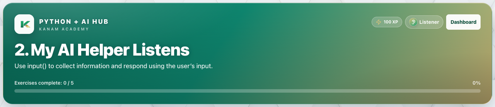
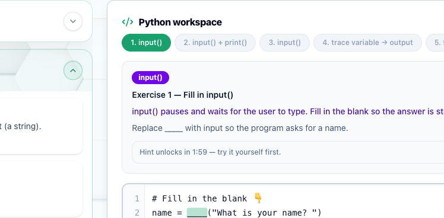
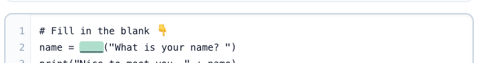

# Facilitator guide — Python & AI · Week 1 · Session 2

**Lesson id:** `lesson-2` · **URL:** `/learn/2`  
**Title:** My AI Helper Listens  
**Source config:** `lib/pythonLessons/lesson2.ts`

---

## 1. Session snapshot

| Field | Value |
| --- | --- |
| **Time** | 45–60 min |
| **Week theme** | Meet Your AI Helper — output, variables, and input |
| **Student goal** | Use `input()` to collect information and respond using the user’s input. |
| **Standards** | `2-AP-11`, `2-AP-17`, `2-IC-22` |
| **Materials** | Browser devices · projector · students need a way to type answers when prompted |
| **XP / badge** | 100 · Listener |

**Learning objectives**

1. Capture user input into a variable.
2. Incorporate that value into a printed response.
3. Reason about program *state* changing at runtime.
4. Test with more than one input (pro habit).

**Evidence of mastery:** Program reads input and echoes a personalized response.

---

## 2. Pre-class setup

- [ ] Open `/learn/2`; confirm `input()` prompts work in the in-browser runner
- [ ] Demo once with two different names so students see output change
- [ ] Know the silent default: empty input may fall back to `"Alex"` in the runner — still ask students to type real names when testing
- [ ] Help Pocket coach note visible for “listen” metaphor

---

## 3. Run of show

| Minutes | Phase | Facilitator | Students |
| ---: | --- | --- | --- |
| 0–5 | **Warm-up** | *“Last time our helper could talk. What would it need to do to *listen*?”* | Quick share |
| 5–12 | **Teach** | Paraphrase coach’s note: `input()` is a pause button; always returns text; store it in a variable; different input → different output, still human-written rules. | Follow Lesson / Help Pocket |
| 12–30 | **Practice (guided)** | Guided fill: `name = input("...")` + personalized `print`. Circulate; if stuck on the prompt string, check quotes and parentheses. | Guided exercise · Run & check |
| 30–45 | **Practice (scratch + test)** | Require **two runs** with different names before they claim done. | Scratch · test range of inputs (`2-AP-17`) |
| 45–55 | **CFU** | Why does `input()` always return text? What if you don’t store it in a variable? | Answer before reveal |
| 55–60 | **Close** | Exit ticket + week reflection. Optional talk-about-it: literal instructions going wrong. | Reflection sentence |

### Coach’s note (from product)

Last time, our AI helper could talk. Today we teach it how to **listen**.

We do that with `input()`. Think of `input()` like a pause button:

- Your program stops.
- The user types something.
- When they press Enter, that answer becomes a value.

**Important AI idea:** AI systems respond to input, but they do **not** think or choose answers on their own. Different input can create different output, but the behavior still follows rules written by humans.

**Key reminder:** `input()` always returns text (a string). Store it in a variable if you want to use it later.

**Test like a pro:** Run it with two different names and watch how the output changes.

### Guided steps (product)

1. Ask the question: `name = input("What is your name? ")`
2. Store the input in a variable called `name`.
3. Print a response that uses the variable: `print("Nice to meet you, " + name)`
4. Run it with different inputs to confirm different names produce different output.

---

## 4. Screenshot callouts

| ID | Capture | Filename |
| --- | --- | --- |
| A | Lesson hero / goal | `python-w1-s2-hero.png` |
| B | Tabs | `python-w1-s2-tabs.png` |
| C | Help Pocket — listen / input | `python-w1-s2-help.png` |
| D | Editor with `input()` starter | `python-w1-s2-editor.png` |
| E | Run & check after typing a name | `python-w1-s2-run.png` |
| F | Console personalized greeting | `python-w1-s2-console.png` |

**Capture checklist:** ✅ Captured from local `/learn/2` → Exercises (after lesson-module unlock) → Coach’s note → `input()` fill → Run & check → PNGs in `../images/python-w1-s2-*.png`.

---

## 5. What “good” looks like

- **Mastery signal:** Two successful runs with different names; print uses the variable (not a hard-coded second name).
- **Common mistakes:**
  - Calling `input()` but not assigning → can’t reuse the answer.
  - Forgetting parentheses or quotes on the prompt string.
  - Expecting numbers to be “math numbers” — remind: still text until converted (future lessons).
- **Differentiation:**
  - **Needs support:** Stay on single `input` + one `print`; mentor asks what happens if the user types a number.
  - **Ready for more (Try This):** Ask name **and** favorite color; one sentence using both; change the response wording.

**Ethics moment (product):** AI can respond to input, but it doesn’t understand like a human. Humans write the rules and are responsible for the outcomes.

**Do-it-yourself (week):** Make the helper ask for name *and* favorite color, then print one sentence using both.

---

## 6. Exit ticket & instructor progress

**Exit ticket:** *Why should you run your program more than once with different answers?*

**Week reflection:** *What did my AI learn to do this week?* (talk + listen)

**Progress check:** `lesson-2` exercise success. If Session 1 incomplete, don’t block Session 2 forever in a live class — pair them, but note the gap for makeup.
