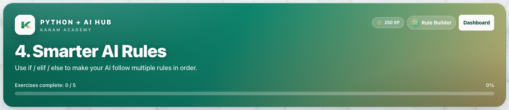

# Facilitator guide — Python & AI · Week 2 · Session 2

**Lesson id:** `lesson-4` · **URL:** `/learn/4`

---

## 1. Session snapshot

| Field | Value |
| --- | --- |
| **Track / lesson id** | `ai-python` / `lesson-4` |
| **Title** | Smarter AI Rules |
| **Time** | 45–60 min |
| **Week theme** | Teaching AI to Decide |
| **Student goal** | Use if / elif / else to make your AI follow multiple rules in order. |
| **Standards** | CSTA 2-AP / 3A-AP (see track doc) |
| **Materials** | Browser devices · projector · keyboard for coding |
| **XP / badge** | 250 · Rule Builder |

**Learning objectives**

1. State today’s goal in one sentence.
2. Complete guided practice with feedback.
3. Complete the scratch / unaided challenge (or equivalent).
4. Pass the lesson check (exercise success and/or CFU).

---

## 2. Pre-class setup

- [ ] Open `/learn/4` on the projector (lesson loads)
- [ ] Confirm Help / Guidance panel is reachable
- [ ] Decide self-paced vs live cohort pacing
- [ ] Optional: complete the first check yourself
- [ ] Bookmark instructor progress for end-of-class glance

**Projector tips:** Zoom ~110%; keep feedback / console / quiz results visible when demoing.

---

## 3. Run of show

| Minutes | Phase | Facilitator | Students |
| ---: | --- | --- | --- |
| 0–5 | **Warm-up** | Ask: “In one sentence, what should our AI helper be able to do after today?” (tie to: Smarter AI Rules) | Think / pair share |
| 5–15 | **Teach** | Open Lesson tab; paraphrase coach’s note / Word help | Follow along |
| 15–40 | **Practice** | Circulate; hints before answers; celebrate first green checks | guided fill → scratch |
| 40–50 | **Check** | Run & check + CFU; ask “what does this prove?” | Answer / show output |
| 50–60 | **Close** | Exit ticket + preview next session | One-sentence reflection |

### Coach’s note (from product — paraphrase)

**Coach’s note**:
Last session, our AI helper could make a simple choice (if/else).
Today, we’re going to teach it how to make **better choices** with more rules.

New tool: `elif` (else if)
- Python checks rules from **top to bottom**.
- The **first** rule that matches is the one that runs.
- After a match happens, Python stops checking the rest.

AI idea:
Adding more rules can make an AI look “smarter”…
…but it still follows human-defined logic.
If your rules are unclear or in the wrong order, the behavior can look wrong.

Common mistakes to watch for:
- Missing colons (:) after if/elif/else
- Indentation errors (print must be indented under each rule)
- Using multiple if statements instead of elif (that can cause confusing behavior)

How to test like a teacher:
Run it with Alex, Jordan, and one other name and confirm you get 3 different outputs.

### Guided steps (product)

1. What is your name? 
2. Alex
3. Jordan
4. Catch-all (else): print a message for everyone else.
5. Test multiple names and observe how rule order affects which message runs.
### Try This / stretch

- VIP rule (Easy): Add a VIP name that MUST appear first (top rule).
- Name length (Medium): Add a rule for short names (like 3 letters) vs long names.
- New input (Bonus): Instead of names, ask for a mood or favorite subject and build rules for it.

---

## 4. Screenshot callouts

| ID | Capture | Filename |
| --- | --- | --- |
| A | Lesson hero / title + goal | `python-w2-s2-hero.png` |
| B | Lesson / Exercises (or Quiz) tabs | `python-w2-s2-tabs.png` |
| C | Help / Coach guidance open | `python-w2-s2-help.png` |
| D | Main workspace (editor, query, or quiz) | `python-w2-s2-editor.png` |
| E | Success / check state | `python-w2-s2-run.png` |
| F | Evidence panel (console, chart, or score) | `python-w2-s2-console.png` |

**Capture checklist:** local unlock → `/learn/4` → Lesson → Practice/Quiz → success state → save under `facilitator-guides/images/`.

---

## 5. What “good” looks like

- **Mastery signal:** Student can restate the goal and show product evidence (green check, quiz pass, or studio artifact) without reading the answer key.
- **Common mistakes:**
- Quotes / spaces / `Print` vs `print`
- Skipping Run & check after a change
- Hard-coding answers instead of using variables / `input()`
- **Differentiation:**
  - **Needs support:** Stay on guided path; re-read Help / Word help; use hints before scratch.
  - **Ready for more:** Try This / stretch scenario; teach-back to a peer in 60 seconds.

---

## 6. Exit ticket & instructor progress

**Exit ticket:** *What can you do now that you couldn’t do before this session — and how do you know?*

**Progress check:** Confirm lesson opened + check success (exercise / quiz / assessment). Incomplete usually means stuck on a single concept — return to Help, not a new lecture.
