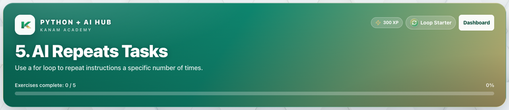

# Facilitator guide — Python & AI · Week 3 · Session 1

**Lesson id:** `lesson-5` · **URL:** `/learn/5`

---

## 1. Session snapshot

| Field | Value |
| --- | --- |
| **Track / lesson id** | `ai-python` / `lesson-5` |
| **Title** | AI Repeats Tasks |
| **Time** | 45–60 min |
| **Week theme** | Repeating Work |
| **Student goal** | Use a for loop to repeat instructions a specific number of times. |
| **Standards** | CSTA 2-AP / 3A-AP (see track doc) |
| **Materials** | Browser devices · projector · keyboard for coding |
| **XP / badge** | 300 · Loop Starter |

**Learning objectives**

1. State today’s goal in one sentence.
2. Complete guided practice with feedback.
3. Complete the scratch / unaided challenge (or equivalent).
4. Pass the lesson check (exercise success and/or CFU).

---

## 2. Pre-class setup

- [ ] Open `/learn/5` on the projector (lesson loads)
- [ ] Confirm Help / Guidance panel is reachable
- [ ] Decide self-paced vs live cohort pacing
- [ ] Optional: complete the first check yourself
- [ ] Bookmark instructor progress for end-of-class glance

**Projector tips:** Zoom ~110%; keep feedback / console / quiz results visible when demoing.

---

## 3. Run of show

| Minutes | Phase | Facilitator | Students |
| ---: | --- | --- | --- |
| 0–5 | **Warm-up** | Ask: “In one sentence, what should our AI helper be able to do after today?” (tie to: AI Repeats Tasks) | Think / pair share |
| 5–15 | **Teach** | Open Lesson tab; paraphrase coach’s note / Word help | Follow along |
| 15–40 | **Practice** | Circulate; hints before answers; celebrate first green checks | guided fill → scratch |
| 40–50 | **Check** | Run & check + CFU; ask “what does this prove?” | Answer / show output |
| 50–60 | **Close** | Exit ticket + preview next session | One-sentence reflection |

### Coach’s note (from product — paraphrase)

**Coach’s note**:
So far, your bot can talk, listen, and make choices.

Today, you’re giving it a new superpower: **repetition**.

Computers and AI systems are great at doing the same thing again and again without getting tired.
When we tell a program to repeat something, we use a ==loop==.

A loop is like saying:

“Do this exact action…
then do it again…
and again…
a specific number of times.”

In this lesson, you’ll use a `for` loop to control repetition.

Here’s how to think like a coder today:

First, tell Python how many times you want something to repeat.

Then, tell Python what action should repeat.

Python will handle the counting for you.

Important things to remember:

A `for` loop line must end with a ==colon (:)==.

Anything that should repeat must be ==indented== underneath the loop.

If a line is not indented, it only runs one time.

Two super common mistakes (and how to fix them):

Missing the ==colon (:)== → Python doesn’t know where the loop starts.

Forgetting ==indentation== → Your message prints only once.

**Mini goal**:
Make your bot say the same message multiple times using a ==loop==.

Read the steps, fill in the blanks, then press [[Run]].

### Guided steps (product)

1. Start a for loop that runs 5 times using range(5).
2. Inside the loop, use print() to show a message from your bot.
3. Make sure the print line is indented.
4. Press Run and read the console carefully.
5. Common mistake: If your message only prints once, your indentation is wrong.
### Try This / stretch

- Change the count: make the loop run 3 times, then 10 times.
- Personal loop: include your name in the message.
- Challenge: store the message in a variable and print it inside the loop.

---

## 4. Screenshot callouts

| ID | Capture | Filename |
| --- | --- | --- |
| A | Lesson hero / title + goal | `python-w3-s1-hero.png` |
| B | Lesson / Exercises (or Quiz) tabs | `python-w3-s1-tabs.png` |
| C | Help / Coach guidance open | `python-w3-s1-help.png` |
| D | Main workspace (editor, query, or quiz) | `python-w3-s1-editor.png` |
| E | Success / check state | `python-w3-s1-run.png` |
| F | Evidence panel (console, chart, or score) | `python-w3-s1-console.png` |

**Capture checklist:** local unlock → `/learn/5` → Lesson → Practice/Quiz → success state → save under `facilitator-guides/images/`.

---

## 5. What “good” looks like

- **Mastery signal:** Student can restate the goal and show product evidence (green check, quiz pass, or studio artifact) without reading the answer key.
- **Common mistakes:**
- Quotes / spaces / `Print` vs `print`
- Skipping Run & check after a change
- Hard-coding answers instead of using variables / `input()`
- **Differentiation:**
  - **Needs support:** Stay on guided path; re-read Help / Word help; use hints before scratch.
  - **Ready for more:** Try This / stretch scenario; teach-back to a peer in 60 seconds.

---

## 6. Exit ticket & instructor progress

**Exit ticket:** *What can you do now that you couldn’t do before this session — and how do you know?*

**Progress check:** Confirm lesson opened + check success (exercise / quiz / assessment). Incomplete usually means stuck on a single concept — return to Help, not a new lecture.
