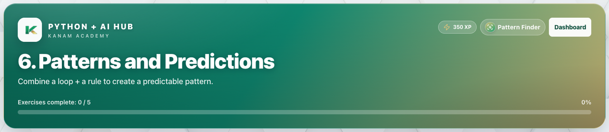

# Facilitator guide — Python & AI · Week 3 · Session 2

**Lesson id:** `lesson-6` · **URL:** `/learn/6`

---

## 1. Session snapshot

| Field | Value |
| --- | --- |
| **Track / lesson id** | `ai-python` / `lesson-6` |
| **Title** | Patterns and Predictions |
| **Time** | 45–60 min |
| **Week theme** | Repeating Work |
| **Student goal** | Combine a loop + a rule to create a predictable pattern. |
| **Standards** | CSTA 2-AP / 3A-AP (see track doc) |
| **Materials** | Browser devices · projector · keyboard for coding |
| **XP / badge** | 350 · Pattern Finder |

**Learning objectives**

1. State today’s goal in one sentence.
2. Complete guided practice with feedback.
3. Complete the scratch / unaided challenge (or equivalent).
4. Pass the lesson check (exercise success and/or CFU).

---

## 2. Pre-class setup

- [ ] Open `/learn/6` on the projector (lesson loads)
- [ ] Confirm Help / Guidance panel is reachable
- [ ] Decide self-paced vs live cohort pacing
- [ ] Optional: complete the first check yourself
- [ ] Bookmark instructor progress for end-of-class glance

**Projector tips:** Zoom ~110%; keep feedback / console / quiz results visible when demoing.

---

## 3. Run of show

| Minutes | Phase | Facilitator | Students |
| ---: | --- | --- | --- |
| 0–5 | **Warm-up** | Ask: “In one sentence, what should our AI helper be able to do after today?” (tie to: Patterns and Predictions) | Think / pair share |
| 5–15 | **Teach** | Open Lesson tab; paraphrase coach’s note / Word help | Follow along |
| 15–40 | **Practice** | Circulate; hints before answers; celebrate first green checks | guided fill → scratch |
| 40–50 | **Check** | Run & check + CFU; ask “what does this prove?” | Answer / show output |
| 50–60 | **Close** | Exit ticket + preview next session | One-sentence reflection |

### Coach’s note (from product — paraphrase)

**Coach’s note**:
Your bot can already repeat actions using a ==loop==.
Now we’re adding ==rules== inside the loop.
This is how ==patterns== are created.

A pattern is what happens when the same rule is checked again and again.

Here’s how to think like a coder today:
The ==loop== controls how many times something happens.
The ==rule== controls what happens each time.
Together, they create a ==pattern==.

Two super common mistakes (and how to fix them):
Rule placement: If the rule is outside the loop, it only runs once.
Prediction: Always try to ==predict== what will print before pressing [[Run]].

**Mini goal**:
Make your bot print different messages by checking a rule inside a loop.
Read the steps, fill the blanks, then press [[Run]].

### Guided steps (product)

1. Start a for loop that runs 5 times using `range(5)`.
2. Inside the loop, use an if statement to check a condition.
3. Print one message if the condition is true and a different message if it is false.
4. Press [[Run]] and read the console carefully.
5. Common mistake: If your output doesn’t change, make sure your rule is inside the loop.
### Try This / stretch

- Change the rule so the message changes every other loop run.
- Print the loop number along with the message (use the loop variable).
- Create your own pattern using a different rule (different words or a different condition).

---

## 4. Screenshot callouts

| ID | Capture | Filename |
| --- | --- | --- |
| A | Lesson hero / title + goal | `python-w3-s2-hero.png` |
| B | Lesson / Exercises (or Quiz) tabs | `python-w3-s2-tabs.png` |
| C | Help / Coach guidance open | `python-w3-s2-help.png` |
| D | Main workspace (editor, query, or quiz) | `python-w3-s2-editor.png` |
| E | Success / check state | `python-w3-s2-run.png` |
| F | Evidence panel (console, chart, or score) | `python-w3-s2-console.png` |

**Capture checklist:** local unlock → `/learn/6` → Lesson → Practice/Quiz → success state → save under `facilitator-guides/images/`.

---

## 5. What “good” looks like

- **Mastery signal:** Student can restate the goal and show product evidence (green check, quiz pass, or studio artifact) without reading the answer key.
- **Common mistakes:**
- Quotes / spaces / `Print` vs `print`
- Skipping Run & check after a change
- Hard-coding answers instead of using variables / `input()`
- **Differentiation:**
  - **Needs support:** Stay on guided path; re-read Help / Word help; use hints before scratch.
  - **Ready for more:** Try This / stretch scenario; teach-back to a peer in 60 seconds.

---

## 6. Exit ticket & instructor progress

**Exit ticket:** *What can you do now that you couldn’t do before this session — and how do you know?*

**Progress check:** Confirm lesson opened + check success (exercise / quiz / assessment). Incomplete usually means stuck on a single concept — return to Help, not a new lecture.
