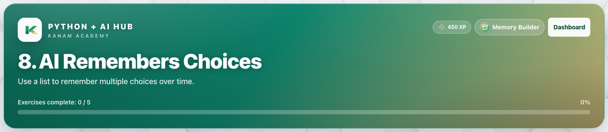

# Facilitator guide — Python & AI · Week 5 · Session 1

**Lesson id:** `lesson-8` · **URL:** `/learn/8`

---

## 1. Session snapshot

| Field | Value |
| --- | --- |
| **Track / lesson id** | `ai-python` / `lesson-8` |
| **Title** | AI Remembers Choices |
| **Time** | 45–60 min |
| **Week theme** | Giving AI a Memory |
| **Student goal** | Use a list to remember multiple choices over time. |
| **Standards** | CSTA 2-AP / 3A-AP (see track doc) |
| **Materials** | Browser devices · projector · keyboard for coding |
| **XP / badge** | 450 · Memory Builder |

**Learning objectives**

1. State today’s goal in one sentence.
2. Complete guided practice with feedback.
3. Complete the scratch / unaided challenge (or equivalent).
4. Pass the lesson check (exercise success and/or CFU).

---

## 2. Pre-class setup

- [ ] Open `/learn/8` on the projector (lesson loads)
- [ ] Confirm Help / Guidance panel is reachable
- [ ] Decide self-paced vs live cohort pacing
- [ ] Optional: complete the first check yourself
- [ ] Bookmark instructor progress for end-of-class glance

**Projector tips:** Zoom ~110%; keep feedback / console / quiz results visible when demoing.

---

## 3. Run of show

| Minutes | Phase | Facilitator | Students |
| ---: | --- | --- | --- |
| 0–5 | **Warm-up** | Ask: “In one sentence, what should our AI helper be able to do after today?” (tie to: AI Remembers Choices) | Think / pair share |
| 5–15 | **Teach** | Open Lesson tab; paraphrase coach’s note / Word help | Follow along |
| 15–40 | **Practice** | Circulate; hints before answers; celebrate first green checks | guided fill → scratch |
| 40–50 | **Check** | Run & check + CFU; ask “what does this prove?” | Answer / show output |
| 50–60 | **Close** | Exit ticket + preview next session | One-sentence reflection |

### Coach’s note (from product — paraphrase)

**Coach’s note**:
So far, your bot has been able to remember one thing at a time.

That’s because we’ve been using ==variables==.

A variable is like one labeled box.
It can only hold one value.

Today, you’re going to help your bot remember more than one thing.
That’s where ==lists== come in.

A list is like a row of boxes instead of just one.
Each box can hold a piece of information.

Here’s what list memory can look like:
`choices = []`
`choices.append("pizza")`
`choices.append("soccer")`
`print(choices)`
`choices.remove("pizza")`
`print(choices)`

Here’s how to think like a coder today:
- A ==variable== remembers one thing
- A ==list== remembers many things
- You decide what gets added and what gets removed

Nothing is automatic.
Your bot only remembers what you tell it to remember.

**Mini goal**:
Make your bot remember multiple choices by saving them in a list.

Read the steps, follow them in order, then press [[Run]].

### Guided steps (product)

1. Create an empty list to store choices.
2. pizza
3. Add the choice to the list with append().
4. Print the list to see what the bot remembers.
5. Remove one item from the list.
6. Print the list again to see how memory changed.
7. Common mistake: If the list never changes, make sure you actually added or removed an item.
### Try This / stretch

- Add more than one answer to the list (append twice).
- Remove a different item.
- Challenge: Explain why remembering everything could be a problem.

---

## 4. Screenshot callouts

| ID | Capture | Filename |
| --- | --- | --- |
| A | Lesson hero / title + goal | `python-w5-s1-hero.png` |
| B | Lesson / Exercises (or Quiz) tabs | `python-w5-s1-tabs.png` |
| C | Help / Coach guidance open | `python-w5-s1-help.png` |
| D | Main workspace (editor, query, or quiz) | `python-w5-s1-editor.png` |
| E | Success / check state | `python-w5-s1-run.png` |
| F | Evidence panel (console, chart, or score) | `python-w5-s1-console.png` |

**Capture checklist:** local unlock → `/learn/8` → Lesson → Practice/Quiz → success state → save under `facilitator-guides/images/`.

---

## 5. What “good” looks like

- **Mastery signal:** Student can restate the goal and show product evidence (green check, quiz pass, or studio artifact) without reading the answer key.
- **Common mistakes:**
- Quotes / spaces / `Print` vs `print`
- Skipping Run & check after a change
- Hard-coding answers instead of using variables / `input()`
- **Differentiation:**
  - **Needs support:** Stay on guided path; re-read Help / Word help; use hints before scratch.
  - **Ready for more:** Try This / stretch scenario; teach-back to a peer in 60 seconds.

---

## 6. Exit ticket & instructor progress

**Exit ticket:** *What can you do now that you couldn’t do before this session — and how do you know?*

**Progress check:** Confirm lesson opened + check success (exercise / quiz / assessment). Incomplete usually means stuck on a single concept — return to Help, not a new lecture.
