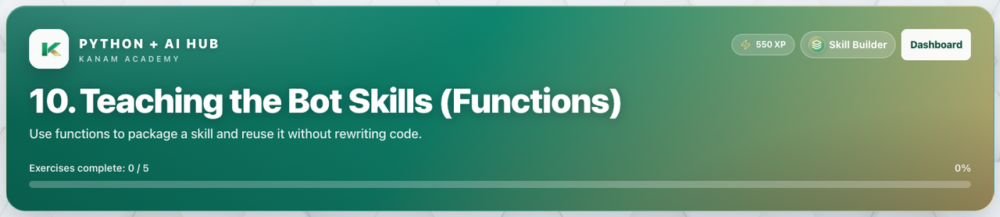

# Facilitator guide — Python & AI · Week 6 · Session 1

**Lesson id:** `lesson-10` · **URL:** `/learn/10`

---

## 1. Session snapshot

| Field | Value |
| --- | --- |
| **Track / lesson id** | `ai-python` / `lesson-10` |
| **Title** | Teaching the Bot Skills (Functions) |
| **Time** | 45–60 min |
| **Week theme** | Reusable Skills |
| **Student goal** | Use functions to package a skill and reuse it without rewriting code. |
| **Standards** | CSTA 2-AP / 3A-AP (see track doc) |
| **Materials** | Browser devices · projector · keyboard for coding |
| **XP / badge** | 550 · Skill Builder |

**Learning objectives**

1. State today’s goal in one sentence.
2. Complete guided practice with feedback.
3. Complete the scratch / unaided challenge (or equivalent).
4. Pass the lesson check (exercise success and/or CFU).

---

## 2. Pre-class setup

- [ ] Open `/learn/10` on the projector (lesson loads)
- [ ] Confirm Help / Guidance panel is reachable
- [ ] Decide self-paced vs live cohort pacing
- [ ] Optional: complete the first check yourself
- [ ] Bookmark instructor progress for end-of-class glance

**Projector tips:** Zoom ~110%; keep feedback / console / quiz results visible when demoing.

---

## 3. Run of show

| Minutes | Phase | Facilitator | Students |
| ---: | --- | --- | --- |
| 0–5 | **Warm-up** | Ask: “In one sentence, what should our AI helper be able to do after today?” (tie to: Teaching the Bot Skills (Functions)) | Think / pair share |
| 5–15 | **Teach** | Open Lesson tab; paraphrase coach’s note / Word help | Follow along |
| 15–40 | **Practice** | Circulate; hints before answers; celebrate first green checks | guided fill → scratch |
| 40–50 | **Check** | Run & check + CFU; ask “what does this prove?” | Answer / show output |
| 50–60 | **Close** | Exit ticket + preview next session | One-sentence reflection |

### Coach’s note (from product — paraphrase)

**Coach's note**
Read this first — it explains the goal + how to think about the code.
**Coach's note**:
Think about a video game controller.
When you press the jump button, the character jumps.
You don't rebuild the jump button every time — it already exists.
That button is like a function.
A function is a named action in your program.
Instead of rewriting the same instructions over and over, you:
- teach the computer the action once
- use it whenever you want

Here's what that looks like in code:
```
def greet():
    print("Hi! Nice to meet you!")
```

This creates a skill, but it doesn't run yet.
To use the skill, you call it:
```
greet()
```

Now the bot speaks.
If you call it again, the bot speaks again — without rewriting the message.
That's how real AI systems reuse behavior.
**Mini goal**:
Create a function that makes your bot speak, then use it more than once.
Read the steps, follow them in order, then press [[Run]].

### Guided steps (product)

1. Define a function that prints a message from your bot.
2. Give the function a clear name.
3. Call the function so it runs.
4. Call the function again without rewriting the code.
5. Change the message inside the function and run it again.
6. Common mistake: If nothing happens, you may have defined the function but forgot to call it.
### Try This / stretch

- Create a second function with a different message.
- Call the same function three times in a row.
- Challenge: Explain how functions help humans control AI behavior.

---

## 4. Screenshot callouts

| ID | Capture | Filename |
| --- | --- | --- |
| A | Lesson hero / title + goal | `python-w6-s1-hero.png` |
| B | Lesson / Exercises (or Quiz) tabs | `python-w6-s1-tabs.png` |
| C | Help / Coach guidance open | `python-w6-s1-help.png` |
| D | Main workspace (editor, query, or quiz) | `python-w6-s1-editor.png` |
| E | Success / check state | `python-w6-s1-run.png` |
| F | Evidence panel (console, chart, or score) | `python-w6-s1-console.png` |



**Capture checklist:** local unlock → `/learn/10` → Lesson → Practice/Quiz → success state → save under `facilitator-guides/images/`.

---

## 5. What “good” looks like

- **Mastery signal:** Student can restate the goal and show product evidence (green check, quiz pass, or studio artifact) without reading the answer key.
- **Common mistakes:**
- Quotes / spaces / `Print` vs `print`
- Skipping Run & check after a change
- Hard-coding answers instead of using variables / `input()`
- **Differentiation:**
  - **Needs support:** Stay on guided path; re-read Help / Word help; use hints before scratch.
  - **Ready for more:** Try This / stretch scenario; teach-back to a peer in 60 seconds.

---

## 6. Exit ticket & instructor progress

**Exit ticket:** *What can you do now that you couldn’t do before this session — and how do you know?*

**Progress check:** Confirm lesson opened + check success (exercise / quiz / assessment). Incomplete usually means stuck on a single concept — return to Help, not a new lecture.
