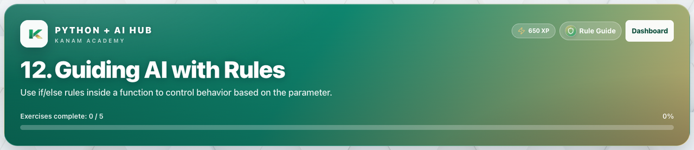

# Facilitator guide — Python & AI · Week 7 · Session 1

**Lesson id:** `lesson-12` · **URL:** `/learn/12`

---

## 1. Session snapshot

| Field | Value |
| --- | --- |
| **Track / lesson id** | `ai-python` / `lesson-12` |
| **Title** | Guiding AI with Rules |
| **Time** | 45–60 min |
| **Week theme** | Smart, Rule-Driven AI |
| **Student goal** | Use if/else rules inside a function to control behavior based on the parameter. |
| **Standards** | CSTA 2-AP / 3A-AP (see track doc) |
| **Materials** | Browser devices · projector · keyboard for coding |
| **XP / badge** | 650 · Rule Guide |

**Learning objectives**

1. State today’s goal in one sentence.
2. Complete guided practice with feedback.
3. Complete the scratch / unaided challenge (or equivalent).
4. Pass the lesson check (exercise success and/or CFU).

---

## 2. Pre-class setup

- [ ] Open `/learn/12` on the projector (lesson loads)
- [ ] Confirm Help / Guidance panel is reachable
- [ ] Decide self-paced vs live cohort pacing
- [ ] Optional: complete the first check yourself
- [ ] Bookmark instructor progress for end-of-class glance

**Projector tips:** Zoom ~110%; keep feedback / console / quiz results visible when demoing.

---

## 3. Run of show

| Minutes | Phase | Facilitator | Students |
| ---: | --- | --- | --- |
| 0–5 | **Warm-up** | Ask: “In one sentence, what should our AI helper be able to do after today?” (tie to: Guiding AI with Rules) | Think / pair share |
| 5–15 | **Teach** | Open Lesson tab; paraphrase coach’s note / Word help | Follow along |
| 15–40 | **Practice** | Circulate; hints before answers; celebrate first green checks | guided fill → scratch |
| 40–50 | **Check** | Run & check + CFU; ask “what does this prove?” | Answer / show output |
| 50–60 | **Close** | Exit ticket + preview next session | One-sentence reflection |

### Coach’s note (from product — paraphrase)

**Coach's note**
Read this first — it explains the goal + how to think about the code.
**Coach's note**:
Think about a video game enemy.

A good game doesn't let enemies attack all the time.
Instead, the game follows rules like:

- If the player is close → attack
- Else → wait

That's exactly how AI rules work.

We already know how to make a function and pass information into it.
Now we're adding rules **inside the function** to control behavior.

Here's a simple example:
```
def attack(enemy):
    if enemy == "dragon":
        print("This enemy is too strong! Run!")
    else:
        print("You attack the " + enemy + "!")
```

Same function.
Same parameter.
Different behavior — because of rules.

Here's how to think like a coder today:

- Parameters give information
- Rules decide what to do with that information
- The function follows rules exactly — no guessing

**Mini goal**:
Create a function that responds differently based on rules you define.
Read the steps, follow them in order, then press [[Run]].

### Guided steps (product)

1. Create a function with one parameter.
2. Add an `if` statement that checks the parameter.
3. Print one message if the condition is true.
4. Add an `else` message for all other cases.
5. Call the function with different values.
6. Predict the output before pressing Run.
7. Common mistake: If the same message prints every time, check your condition.
### Try This / stretch

- Add a second rule using `elif` (example: a special message for `"boss"`).
- Rewrite one message to sound more helpful and safe.
- Challenge: Explain how rules protect users from bad behavior.

---

## 4. Screenshot callouts

| ID | Capture | Filename |
| --- | --- | --- |
| A | Lesson hero / title + goal | `python-w7-s1-hero.png` |
| B | Lesson / Exercises (or Quiz) tabs | `python-w7-s1-tabs.png` |
| C | Help / Coach guidance open | `python-w7-s1-help.png` |
| D | Main workspace (editor, query, or quiz) | `python-w7-s1-editor.png` |
| E | Success / check state | `python-w7-s1-run.png` |
| F | Evidence panel (console, chart, or score) | `python-w7-s1-console.png` |



**Capture checklist:** local unlock → `/learn/12` → Lesson → Practice/Quiz → success state → save under `facilitator-guides/images/`.

---

## 5. What “good” looks like

- **Mastery signal:** Student can restate the goal and show product evidence (green check, quiz pass, or studio artifact) without reading the answer key.
- **Common mistakes:**
- Quotes / spaces / `Print` vs `print`
- Skipping Run & check after a change
- Hard-coding answers instead of using variables / `input()`
- **Differentiation:**
  - **Needs support:** Stay on guided path; re-read Help / Word help; use hints before scratch.
  - **Ready for more:** Try This / stretch scenario; teach-back to a peer in 60 seconds.

---

## 6. Exit ticket & instructor progress

**Exit ticket:** *What can you do now that you couldn’t do before this session — and how do you know?*

**Progress check:** Confirm lesson opened + check success (exercise / quiz / assessment). Incomplete usually means stuck on a single concept — return to Help, not a new lecture.
