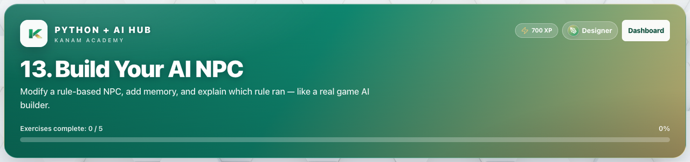

# Facilitator guide — Python & AI · Week 8 · Session 1

**Lesson id:** `lesson-13` · **URL:** `/learn/13`

---

## 1. Session snapshot

| Field | Value |
| --- | --- |
| **Track / lesson id** | `ai-python` / `lesson-13` |
| **Title** | Build Your AI NPC |
| **Time** | 45–60 min |
| **Week theme** | Capstone: Build & Ship Your AI |
| **Student goal** | Modify a rule-based NPC, add memory, and explain which rule ran — like a real game AI builder. |
| **Standards** | CSTA 2-AP / 3A-AP (see track doc) |
| **Materials** | Browser devices · projector · keyboard for coding |
| **XP / badge** | 700 · Designer |

**Learning objectives**

1. State today’s goal in one sentence.
2. Complete guided practice with feedback.
3. Complete the scratch / unaided challenge (or equivalent).
4. Pass the lesson check (exercise success and/or CFU).

---

## 2. Pre-class setup

- [ ] Open `/learn/13` on the projector (lesson loads)
- [ ] Confirm Help / Guidance panel is reachable
- [ ] Decide self-paced vs live cohort pacing
- [ ] Optional: complete the first check yourself
- [ ] Bookmark instructor progress for end-of-class glance

**Projector tips:** Zoom ~110%; keep feedback / console / quiz results visible when demoing.

---

## 3. Run of show

| Minutes | Phase | Facilitator | Students |
| ---: | --- | --- | --- |
| 0–5 | **Warm-up** | Ask: “In one sentence, what should our AI helper be able to do after today?” (tie to: Build Your AI NPC) | Think / pair share |
| 5–15 | **Teach** | Open Lesson tab; paraphrase coach’s note / Word help | Follow along |
| 15–40 | **Practice** | Circulate; hints before answers; celebrate first green checks | guided fill → scratch |
| 40–50 | **Check** | Run & check + CFU; ask “what does this prove?” | Answer / show output |
| 50–60 | **Close** | Exit ticket + preview next session | One-sentence reflection |

### Coach’s note (from product — paraphrase)

**Coach's note**
Read this first — it explains the goal + how to think about the code.
**Coach's note**:
Today you're building an **adventure NPC**.

Your NPC is not "smart" on its own.
It follows **rules** you write.
It can also use **npc_memory** (a dictionary) to remember a character profile.

Here's the loop you're building:
- Message (what the player says)
- Rules (if/elif/else)
- Memory (npc_memory)
- Output (what the NPC prints)

Today, we're not using input().
We test by changing variables like player_text = "hello".

When you test your NPC, always ask:
**Which rule ran, and why?**

**Mini goal**:
Create a character profile in npc_memory, then make the NPC talk like it's a quest.
Press [[Run]] to test your code, then improve it.

### Guided steps (product)

1. Fill in the blanks in the guided NPC (keywords + fallback message).
2. Press Run and test with different messages (hello/game/anything else).
3. In scratch, rebuild the NPC without hints.
4. name
5. name
6. Improve the fallback message so it's helpful.
### Try This / stretch

- Add an `elif` rule (a second special case).
- Rewrite your messages to be more helpful and kind.
- Challenge: Add a rule that handles very short messages safely.
- Capstone prep pair share: sketch character + 3 keywords with a partner; credit both names on the sketch.

### Capstone planning protocol (5–10 min)

Pair students to draft tomorrow’s Quest Adventure Bot plan (character, quest, 3 keywords). Both names on the paper. Rubric: [collaboration-attribution.md](../../rubrics/collaboration-attribution.md). Solo learners still write the plan alone — pairing is encouraged, not required for product completion.

---

## 4. Screenshot callouts

| ID | Capture | Filename |
| --- | --- | --- |
| A | Lesson hero / title + goal | `python-w8-s1-hero.png` |
| B | Lesson / Exercises (or Quiz) tabs | `python-w8-s1-tabs.png` |
| C | Help / Coach guidance open | `python-w8-s1-help.png` |
| D | Main workspace (editor, query, or quiz) | `python-w8-s1-editor.png` |
| E | Success / check state | `python-w8-s1-run.png` |
| F | Evidence panel (console, chart, or score) | `python-w8-s1-console.png` |

**Capture checklist:** local unlock → `/learn/13` → Lesson → Practice/Quiz → success state → save under `facilitator-guides/images/`.

---

## 5. What “good” looks like

- **Mastery signal:** Student can restate the goal and show product evidence (green check, quiz pass, or studio artifact) without reading the answer key.
- **Common mistakes:**
- Quotes / spaces / `Print` vs `print`
- Skipping Run & check after a change
- Hard-coding answers instead of using variables / `input()`
- **Differentiation:**
  - **Needs support:** Stay on guided path; re-read Help / Word help; use hints before scratch.
  - **Ready for more:** Try This / stretch scenario; teach-back to a peer in 60 seconds.

---

## 6. Exit ticket & instructor progress

**Exit ticket:** *What can you do now that you couldn’t do before this session — and how do you know?*

**Progress check:** Confirm lesson opened + check success (exercise / quiz / assessment). Incomplete usually means stuck on a single concept — return to Help, not a new lecture.
