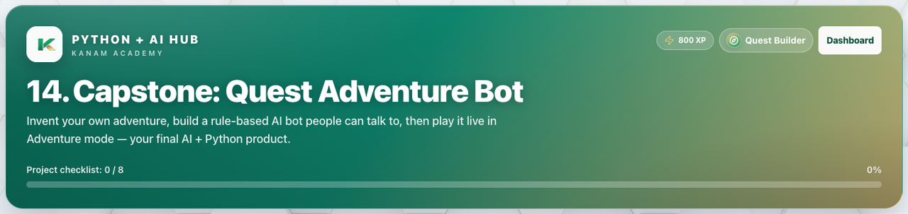

# Facilitator guide — Python & AI · Week 8 · Session 2

**Lesson id:** `lesson-14` · **URL:** `/learn/14`

---

## 1. Session snapshot

| Field | Value |
| --- | --- |
| **Track / lesson id** | `ai-python` / `lesson-14` |
| **Title** | Capstone: Quest Adventure Bot |
| **Time** | 45–60 min |
| **Week theme** | Capstone: Build & Ship Your AI |
| **Student goal** | Invent your own adventure, build a rule-based AI bot people can talk to, then play it live in Adventure mode — your final AI + Python product. |
| **Standards** | CSTA 2-AP / 3A-AP (see track doc) |
| **Materials** | Browser devices · projector · keyboard for coding |
| **XP / badge** | 800 · Quest Builder |

**Learning objectives**

1. State today’s goal in one sentence.
2. Complete guided practice with feedback.
3. Complete the scratch / unaided challenge (or equivalent).
4. Pass the lesson check (exercise success and/or CFU).

---

## 2. Pre-class setup

- [ ] Open `/learn/14` on the projector (lesson loads)
- [ ] Confirm Help / Guidance panel is reachable
- [ ] Decide self-paced vs live cohort pacing
- [ ] Optional: complete the first check yourself
- [ ] Bookmark instructor progress for end-of-class glance

**Projector tips:** Zoom ~110%; keep feedback / console / quiz results visible when demoing.

---

## 3. Run of show

| Minutes | Phase | Facilitator | Students |
| ---: | --- | --- | --- |
| 0–5 | **Warm-up** | Ask: “In one sentence, what should our AI helper be able to do after today?” (tie to: Capstone: Quest Adventure Bot) | Think / pair share |
| 5–15 | **Teach** | Open Lesson tab; paraphrase coach’s note / Word help | Follow along |
| 15–40 | **Practice** | Circulate; hints before answers; celebrate first green checks | guided fill → scratch |
| 40–50 | **Check** | Run & check + CFU; ask “what does this prove?” | Answer / show output |
| 50–60 | **Close** | Exit ticket + preview next session | One-sentence reflection |

### Coach’s note (from product — paraphrase)

**Coach's note — Capstone day (read this first)**

This is **not** five mini drills. You will **invent a story**, **code a rule-based AI**, and **let people play it**.

**What you are building**
A Quest Adventure Bot: a character with memory, rules for what players say, a quest log that grows, and a live chat demo in the **Adventure** tab.

**Skills you will combine** (you already learned each one):
• dictionary = who the bot is (`name`, `role`, plus one world fact)
• list + `.append` = what happened (`quest_log`)
• `def respond(player_input):` = the reusable AI brain
• `if` / `elif` / `else` = story rules for keywords
• `print(...)` + `+` = spoken replies
• `for` + `test_messages` = quick Build tests

**Exact workflow (about 60 minutes)**
1. **Design (5–10 min)** — Write on paper or in comments: character name/role, one quest, 3 keywords, and what each keyword appends to the log.
2. **Build (~30 min)** — Fill the scaffold. Press **Run & check** often. Watch the checklist turn green.
3. **Adventure (~15 min)** — Switch to the Adventure tab. Chat at least **3 turns** (greeting, quest, nonsense or help).
4. **Demo (~10 min)** — Hand the keyboard to a friend. Can they discover your quest without reading the code?

**Build vs Adventure**
• **Build** = you control a fixed `test_messages` list so every rule path is easy to debug.
• **Adventure** = a real player types freely; the same `respond()` brain answers live.

**Done means:** every checklist item is green, including 3+ live Adventure turns.

### Guided steps (product)

1. Design: character (name + role + world fact), one quest, 3 keywords, and log labels for each keyword.
2. Code hero = {...} and quest_log = [].
3. Write def respond(player_input): with if / elif / else — each branch prints (use +) and appends.
4. Add test_messages (include one nonsense string) and a for loop that calls respond(msg).
5. Print the quest log summary, then Run & check until Build items are green.
6. Open Adventure, play 3+ live turns, then demo for a friend.
### Try This / stretch

- Demo: invite a classmate to play Adventure without telling them the keywords — can they discover the quest?
- Add a fourth keyword (like inventory) that prints the quest_log mid-adventure.
- Store a catchphrase in the dictionary and print it when the player says hello.
- Challenge: add a "score" number in the dictionary that goes up when the quest is given.

---

## 4. Screenshot callouts

| ID | Capture | Filename |
| --- | --- | --- |
| A | Lesson hero / title + goal | `python-w8-s2-hero.png` |
| B | Lesson / Exercises (or Quiz) tabs | `python-w8-s2-tabs.png` |
| C | Help / Coach guidance open | `python-w8-s2-help.png` |
| D | Main workspace (editor, query, or quiz) | `python-w8-s2-editor.png` |
| E | Success / check state | `python-w8-s2-run.png` |
| F | Evidence panel (console, chart, or score) | `python-w8-s2-console.png` |

**Capture checklist:** local unlock → `/learn/14` → Lesson → Practice/Quiz → success state → save under `facilitator-guides/images/`.

---

## 5. What “good” looks like

- **Mastery signal:** Student can restate the goal and show product evidence (green check, quiz pass, or studio artifact) without reading the answer key. Paired teams: both can demo Adventure and name their attribution answers.
- **Common mistakes:**
- Quotes / spaces / `Print` vs `print`
- Skipping Run & check after a change
- Hard-coding answers instead of using variables / `input()`
- One partner does all typing with no credit log
- **Differentiation:**
  - **Needs support:** Stay on guided path; re-read Help / Word help; use hints before scratch.
  - **Ready for more:** Try This / stretch scenario; teach-back to a peer in 60 seconds.

### Capstone paired protocol & showcase (CSTA `2-AP-16`)

Score with [collaboration-attribution.md](../../rubrics/collaboration-attribution.md) and [python-capstone.md](../../rubrics/python-capstone.md).

1. **Build:** Rotate driver/navigator every 10–15 minutes (or every checklist milestone).
2. **Adventure demo:** Partner or peer plays without seeing keywords; builder narrates only after.
3. **Attribution (required if paired):** Who drove? What each wrote? Tool/AI suggestions? One improvement.
4. **Showcase:** 60–90 second demo + one limitation (else path or ethics note).

---

## 6. Exit ticket & instructor progress

**Exit ticket:** *What can you do now that you couldn’t do before this session — and how do you know?*  
Paired teams: turn in the four attribution answers with names.

**Progress check:** Confirm lesson opened + check success (exercise / quiz / assessment). Incomplete usually means stuck on a single concept — return to Help, not a new lecture.
